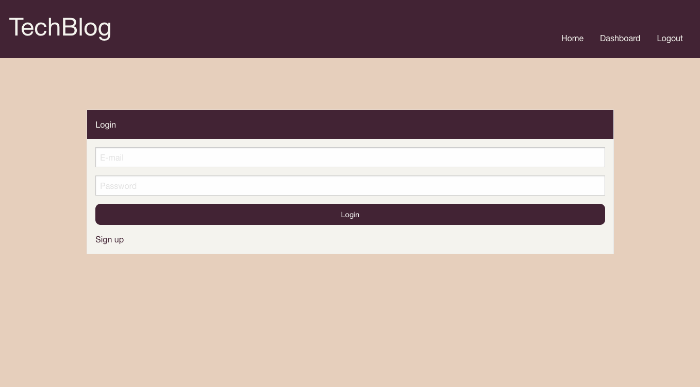
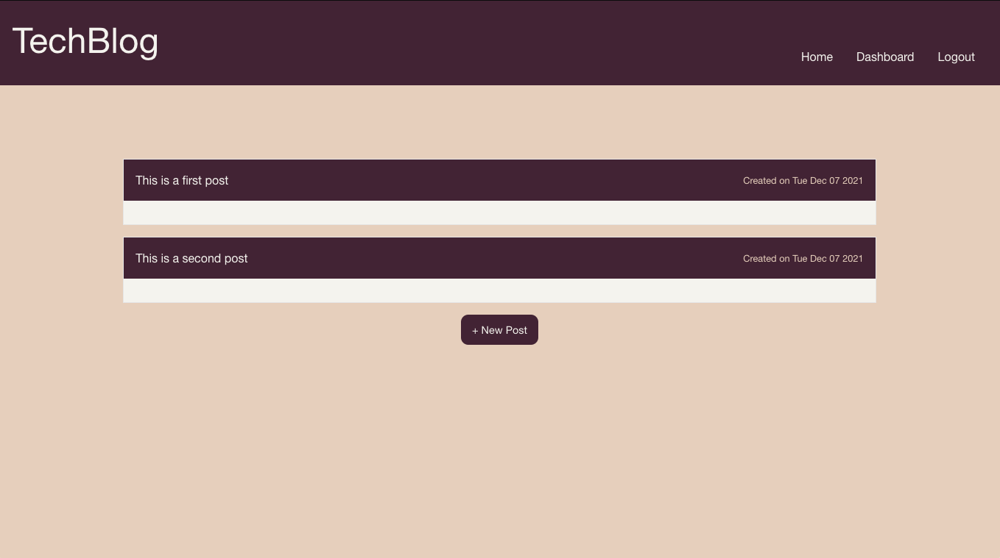

# **Tech Blog**

## **Links**
-View repository [here.](https://github.com/charlottehulseman/sql-tech-blog)
-View deployed website [here.](https://still-hamlet-82360.herokuapp.com/)

-View deployed website [here.]()

## **Description**
Tech blog and first project with MySQL that allows user to create and manage blog posts.

## **Usage Instructions**
Navigate to the deployed website in the link above to view. Use the below details to login and/or create an account. 
email: taco@taco.taco
username: taco
password: password

## **Installation Instructions**
Installation not required, but navigate to the deployed website in the link above or clone the repository, open an integrated terminal in the repo folder, write `npm i` to install the respective packages and then `node seeds/seed.js` and `node server.js` followed by navigating to `localhost:3000` in a browser to view the website. MySQL is required to install.

## **Contact**
Developer GitHub: https://github.com/charlottehulseman
Or contact me via email with any questions at cchulseman@gmail.com